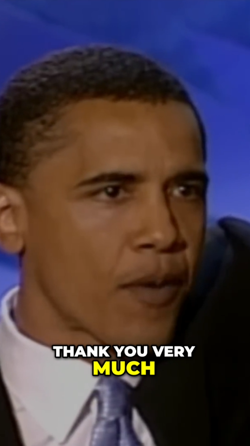
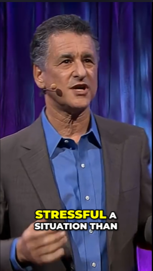

# AI shorts generator

  

A free open-source project designed to turn youtube-videos into viral short videos. Highlight detection, subtitles, translation, voiceover, all in one for your content: no pre-clip credits, watermarks or any paid options. Designed for creators who want an alternative to short-video SaaS tools like OpusClip or Vidyo.ai for free. 

## Examples of a  processed video
<table>
  <tr>
    <td align="center">
       
      <i>"The Speech that Made Obama President"</i>
    </td>
    <td align="center">
       
      <i>"How Tom Overcame Social Anxiety - The Mindset That Changed Everything"</i>
    </td>
    <td align="center">
       
      <i>"How to stay calm when you know you'll be stressed | Daniel Levitin | TED"</i>
    </td>
  </tr>
</table>

# Features 🪁
- **API**: Freely use this generator in your own projects via our API.
- **Convenient**: Paste a YouTube link (any length!) and get a ready-to-post 9:16 short.
- **Hooks option**: When enabled, adds a context-aware AI-generated hook at the start of the clip
- **Web version**: Besides the CLI, you can also generate videos on a local website
- **Smart Highlight Selection**: Finds the most viral, hot moments from your video automatically based on algorithm

  №
